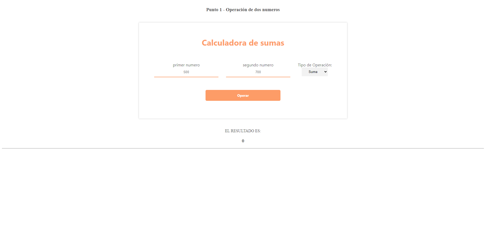
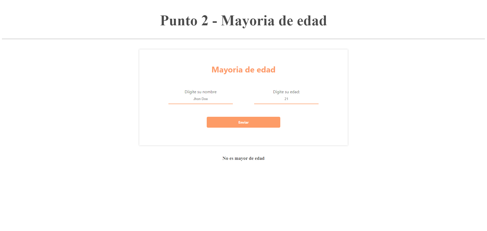
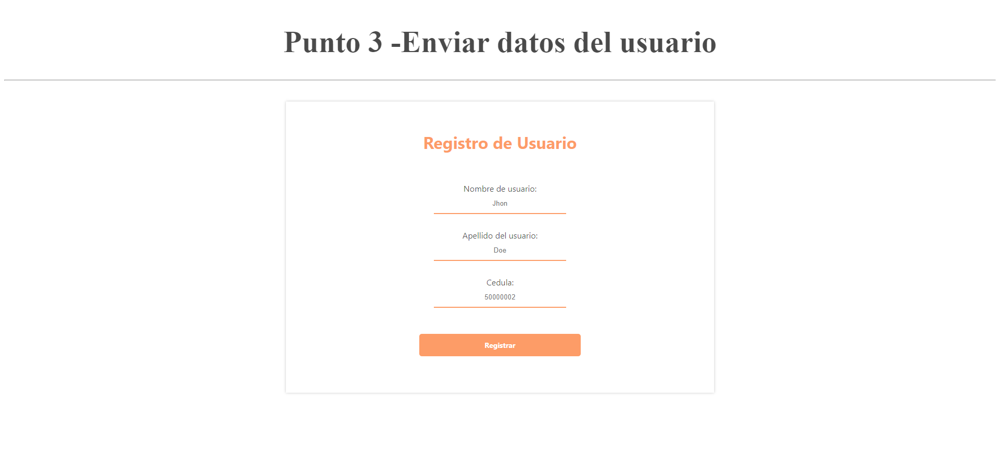
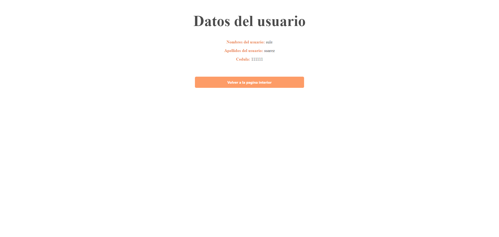
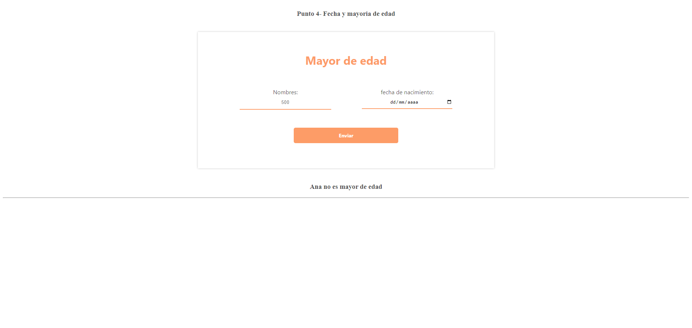
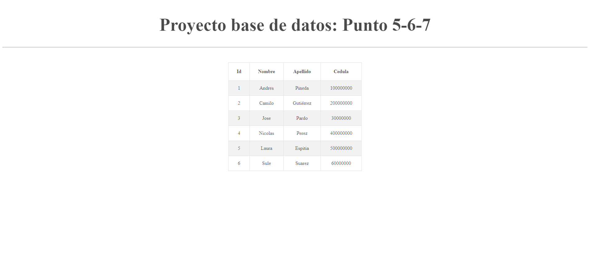

<h1>Taller 10: Sule Suarez </h1>

<h2>Información</h2>

Curso Full Stack Basico -Grupo 1

 Profesor: Cristian Patiño 

<h2> Punto 1: Operaciones Matematicas  </h2>

<h2>Punto 2: Mayoria de edad</h2>

<h2>Punto 3: Datos usuario </h2>

<h2>Punto 4: Fecha de nacimiento- mayoria de edad  </h2>

<h2>Punto 5 -6- 7: </h2>
<h3> 5- base de datos</h3>

<h3> 6- conexión</h3>

<h3> 7- Muestra de datos en Pantalla</h3>

