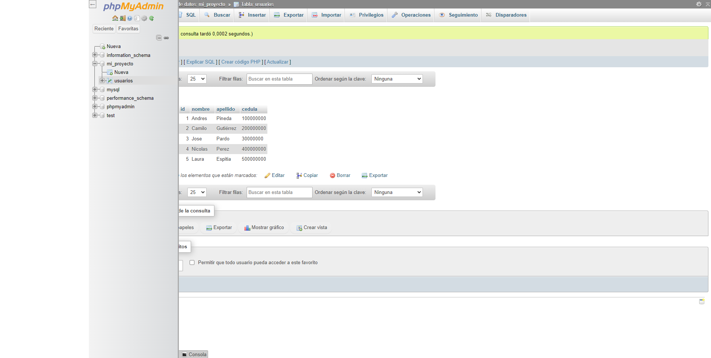
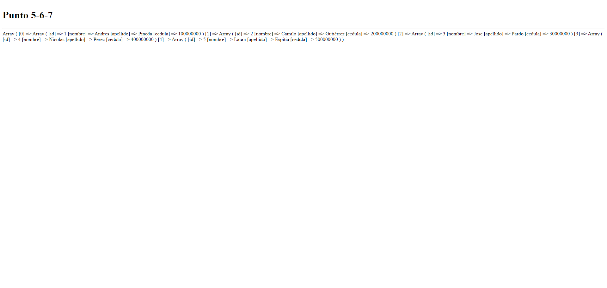

<h1>Taller 10: Sule Suarez </h1>

<h2>Información</h2>

Curso Full Stack Basico -Grupo 1

 Profesor: Cristian Patiño 

<h2> Punto 1:  </h2>

<h2>Punto 2:</h2>

<h2>Punto 3: </h2>

<h2>Punto 4:   </h2>

<h2>Punto 5 -6- 7: </h2>
<h3> 5- base de datos</h3>

<h3> 6- conexión</h3>

